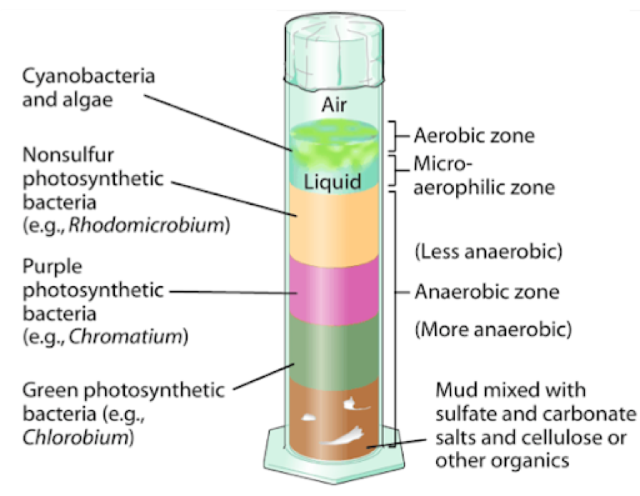
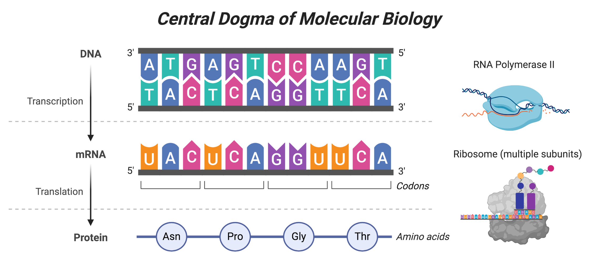
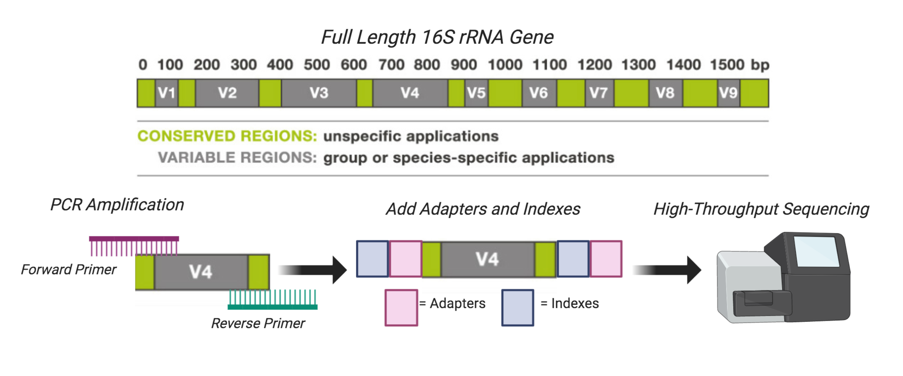

---
title:
output: 
  html_document:
    toc: false
    include:
      after_body: _footer.html
---

```{r setup, include=FALSE}
knitr::opts_chunk$set(echo = TRUE)
```
<br>

# **Winogradsky Column Perturbations**




In this experiment, students collected sediment samples from Lake Mendota in Madison, WI to create Winogradsky columns. The Winogradsky column was invented by Sergei Winogradsky in the 1880s, and the device consisted of a column of pond sediment and water mixed together with a carbon source. Naturally occurring microorganisms establish geochemical gradients along the column based on their different metabolic strategies, which appear as stark color differences. In this small, enclosed ecosystem, students can observe how different microorganisms survive in stratified layers. The top of the column has oxygen available for respiration, whereas the bottom of the column is completely anaerobic, and therefore microbes depend on other compounds than oxygen for growth. 

Once the Winogradsky columns were fully established, students applied various perturbations to their columns. This included adding water, various inhibitors, etc. Students collected samples over time to understand how the Winogradsky column communities changed from the initial perturbation and if they returned to their original state. 

# **16S rRNA Gene Amplicon Sequencing Approach**

The 16S ribosomal RNA gene sequences are used to broadly survey microbial communities without the need for cultivation. This marker or "amplcon" is most often chosen because of 1) its presence in nearly all of life 2) the sequence is highly conserved, and therefore does not undergo extreme changes over time, and 3) this region is large enough to sequence different regions and analyze them with fidelity. The essentiality and conserved nature of the 16S ribosomal RNA gene make sense in light of the central dogma of molecular biology. 



The central dogma describes that DNA is converted to mRNA which is converted to protein, which are done through the processes of transcription and translation, respectively. Transcription is performed by an RNA polymerase, whereas translation is performed by the ribosome - which is made up of multiple subunits, include the 16S subunit. Translation is a very essential process in all of life, since it ensures that proteins are made. And therefore this is a suitable marker to perform broad surveys of a given mixed sample. 

Regions of the 16S rRNA gene are used for high-throughput shotgun sequencing, referred to as V1-V9, which stands for "variable region." The 16S rRNA gene contains both variable and conserved sequences, which can be used to identify different groups of microbes in a mixed sample. This allows us to easily and cheaply sequence lots of samples to study the taxonomical composition and relative abundances of different taxa that are present. 



Once you have obtained raw sequences, you are ready for [preprocessing your sequences](01-preprocessing.html).

<br>

### *Graphics References*
*1) Winogradsky Column: http://dataphys.org/list/winogradsky-column/ *<br> 
*2) Central Dogma Figure: Made by E.A.M with Biorender*<br>
*3) 16S rRNA Gene Figure: Made by E.A.M with Biorender, with variable region figure adapted from https://teachthemicrobiome.weebly.com/sequencing-the-microbiome.html *