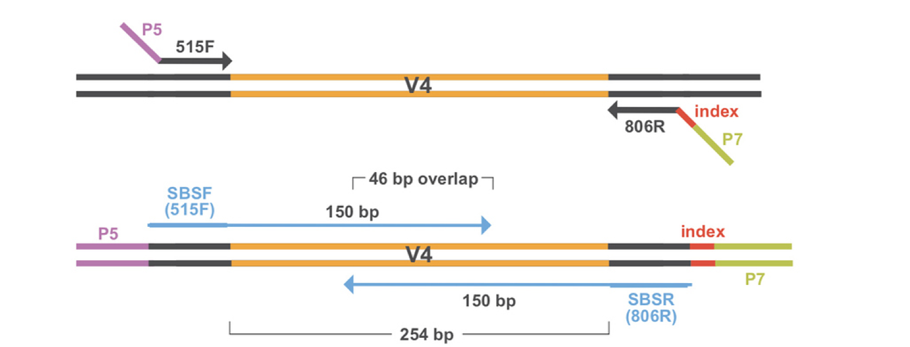
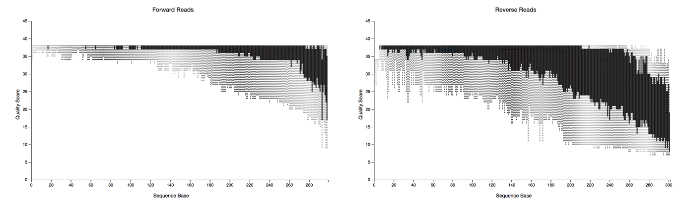
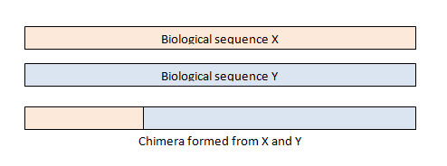

```{r setup, include=FALSE}
knitr::opts_chunk$set(echo = TRUE)
```

## Sequencing Output 

The output of high-throughput sequencing are millions of short, paired-end reads. If you recall from the [Project Overview](00-project-overview.html) page, we applied forward and reverse primers to amplify the V4 region of the 16S rRNA region and add adapters. The adapters on each of end of the region allow for sequencing in both directions - forward and reverse _paired ends._ Using paired ends allows us to sequence both ends of the fragment and still produce high quality sequence data. In the end, this produces twice as many reads as it would if we only sequenced in one direction (single end reads), but also allows for more accurate read alignment since you have information from a pair originating from the same fragment. 



Now that we have all of our paired-end sequencing data, we have to apply a series of filtering and preprocessing steps before we can analyze our data. 

## Overview of Preprocessing Steps

There are numerous methods and bioinformatics pipelines for preprocessing 16S amplicon data. QIIME2 and mothur are the two most popular tools for classifying 16S rRNA gene sequences and grouping into OTUs. In this case, we used mothur to preprocess our Winogradsky samples. The main steps in amplicon sequencing preprocessing are: 

1) Quality Filtering 
2) Merging paired-end reads into contigs 
3) Removing chimeras 
4) Assigning taxonomy 
5) Clustering into Operational Taxonomic Units (OTUs)

First we have to perform some initial quality filtering on the sequences. Because of the way sequencing works, the ends of each paired-end read are usually of lower quality. This is referred to as trimming the ends of sequences. Additionally, the reverse read is overall of lower quality than the forward read. When the sequencer outputs sequencing reads, it also assigns quality scores to each base based on the confidence score. We can filter sequences based on those quality scores so that we are only working with data that we can trust is of high quality. 



Then the paired end reads are merged into what are called contigs. You can think of these as "contiguous units." This just gives us a longer piece of sequencing data to work with when assigning taxonomy and calculating relative abundance by aligning reads back to our assembled contigs. More filtering is applied to these contigs to make sure they are of high quality. 



Then chimeras are removed. Chimeras occur when two biological sequences accidentally are joined together. This happens in amplicon sequencing because closely related sequences are being amplified during PCR. During PCR, an extended strand of DNA can bind to the template of a closely related but different sequence. This forms a chimeric sequence, which we don't want in the final results and thus have them removed in the preprocessing steps. 

Taxonomical classifications are then assigned based on similarity to sequences in a reference database. In this case, we used the SILVA database to assign taxonomy to our sequences. The SILVA database contains curated small subunit - 16S, 18S, SSU and large subunit 23S, 28S, LSU ribosomal RNA sequences for all three domaincs of life - bacteria, archaea, and eukarya. This includes pure cultures and high-quality full-length clones. 

The final and most important (and possibly confusing) step is clustering our sequences into operational taxonomic units, or OTUs. It is literally impossible to go through each individual sequence one by one and analyze relative abundance and taxonomical composition. Additionally there are likely to be redundant sequences of highly abundant groups in your sample. To reduce the complexity, we create OTUs that are proxies for phylogenetic groups and consist of closely related individuals. Typically OTUs are clustered at 97% sequence identity - meaning a single OTU consists of sequences that are at least 97% identical by their sequences. This allows for some minor variations in a couple of bases here and there, so not all sequences have to be exactly identical to be in the same OTU. 

It is important to recognize that since OTUs represent broad groupings of sequences, an OTU cannot represent a single microbial species. Oftentimes, microbes within the same species have identical 16S rRNA sequences, so therefore it is impossible to distinguish from different species based on 16S rRNA amplicon sequencing alone. The preprocessing pipelines will oftentimes assign a species or even a genus name to resulting OTUs. But just because something is similar to what is in a reference database - doesn't mean it holds true. That's why oftentimes you can perform high-level analyses with 16S amplicon sequences such as at the phylum or family levels to look at changes in community composition in different samples. 

## Output Products

At the end of the preprocessing pipeline, two files are used for downstream analysis - a taxonomy file and a "shared" file. The taxonomy file contains what you think it does - the taxonomical classification for each OTU. The shared file is a breakdown of the "counts" that an OTU was observed in for every sample. These two files are then used for our [Analyzing Amplicon Data in R](03-analyzing-amplicon-data.html) lesson. 

<br>

### *Graphics References*

*1) Paired-End Sequencing Figure: QIIME Tutorial *<br> 
*2) Quality Score Figure: QIIME Tutorial *<br> 
*3) Chimera Figure: usearch website: https://drive5.com/usearch/manual/chimeras.html *<br> 
