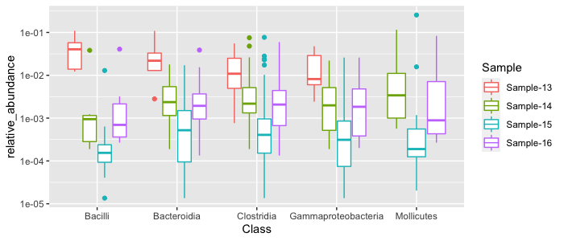
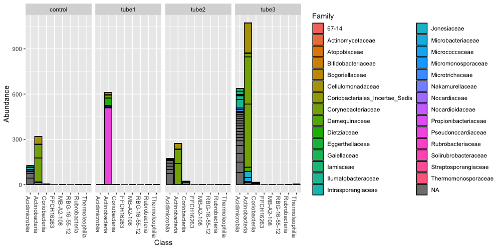
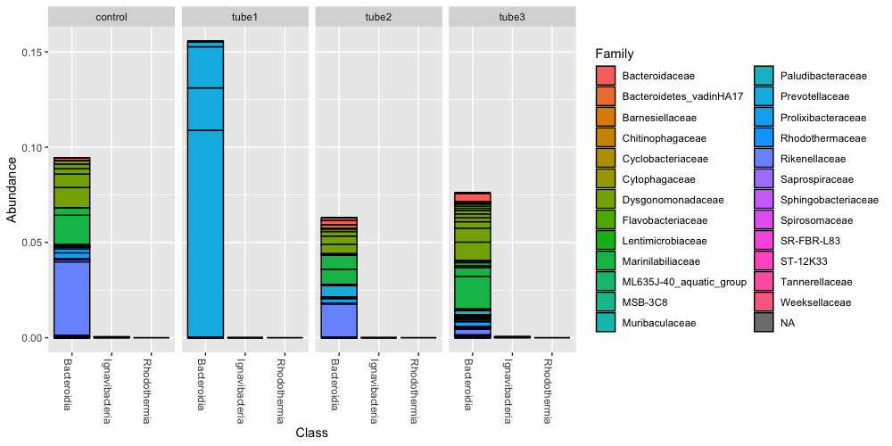
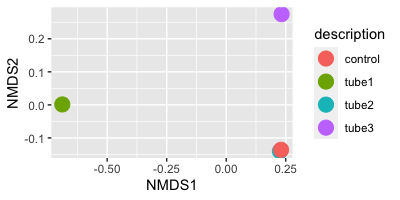
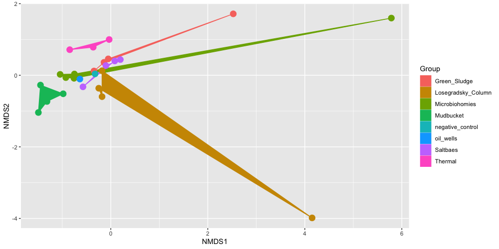
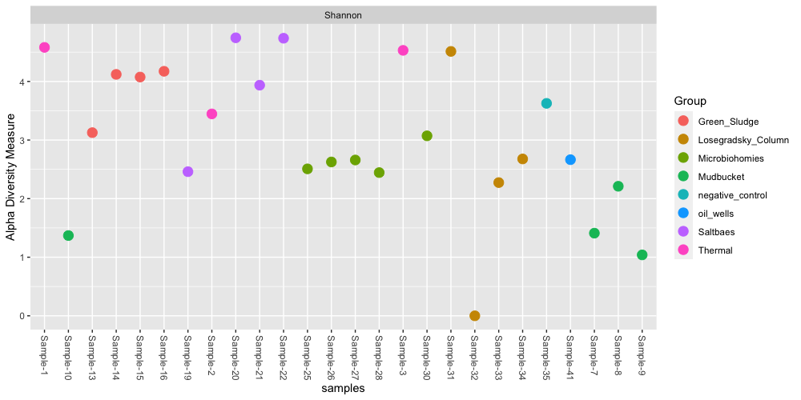
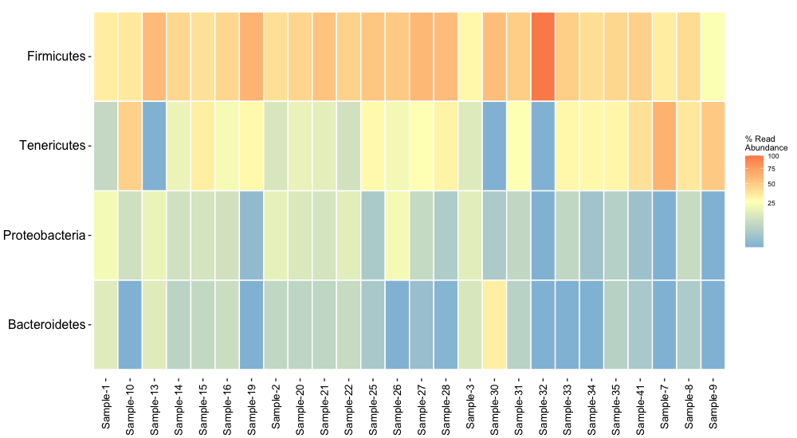
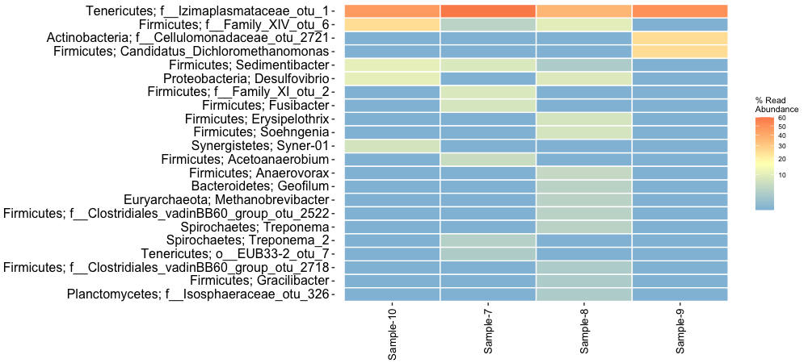

Students performed 16S rRNA sequencing for their Winogradsky column perturbation experiments. We had a total of 26 samples that had sufficient quality DNA to sequence. The samples are split by the name of the file/sample, the group that performed the experiment, and the description of the perturbation that was done to that sample:

```
# Sample	Group	Description
Sample-1	Thermal	Control
Sample-2	Thermal	Heat_Shock
Sample-3	Thermal	Preheat
Sample-7	Mudbucket	Control
Sample-8	Mudbucket	tetracycline_1
Sample-9	Mudbucket	tetracycline_2
Sample-10	Mudbucket	tetracycline_rifampicin
Sample-13	Green_Sludge	tube1
Sample-14	Green_Sludge	tube2
Sample-15	Green_Sludge	tube3
Sample-16	Green_Sludge	control
Sample-19	Saltbaes	control
Sample-20	Saltbaes	sample1
Sample-21	Saltbaes	sample2
Sample-22	Saltbaes	sample3
Sample-25	Microbiohomies	sample1
Sample-26	Microbiohomies	sample2
Sample-27	Microbiohomies	control
Sample-28	Microbiohomies	both
Sample-30	Microbiohomies	no_description
Sample-31	Losegradsky_Column	cpmtrp;
Sample-32	Losegradsky_Column	malathion
Sample-33	Losegradsky_Column	malathion
Sample-34	Losegradsky_Column	malathion
Sample-35	negative_control	negative_control
Sample-41	oil_wells	control
```

# Initial Sample QC Checks

We applied a series of filtering and processing steps to these sequences to make sure we are working with high-quality data for the analysis. To see an overview of these steps, read through the [Preprocessing Overview](01-preprocessing.html) page. 

To look at how the quality stats vary by sample, let's look at the `sample-codes-metadata.csv` containing the information for each sample (as seen above) and the `read-stats.txt` file. The `read-stats.txt` file is a tab-delimited file that contains information for how many reads remained after each preprocessing step. Since this is a tab-delimited file, we can't use `read.csv` or `read_csv` but rather the `read_delim` function. To read in the files: 

```
metadata <- read.csv("raw_data/sample-codes-metadata")
stats <- read_delim("raw_data/reads-stats.txt", delim='\t', col_names = FALSE)
```

Looking at the `head()` of the metadata file: 

```
head(metadata)

    Sample     Group    Description
1 Sample-1   Thermal        Control
2 Sample-2   Thermal     Heat_Shock
3 Sample-3   Thermal        Preheat
4 Sample-7 Mudbucket        Control
5 Sample-8 Mudbucket tetracycline_1
6 Sample-9 Mudbucket tetracycline_2
```

Whereas the `stats` dataframe doesn't have any column names. Let's give it these column names: 

```
colnames(stats) = c("Sample", "total_input_reads", "reads_passed_filtering", "R_reads_after_denoising", "F_reads_after_denoising", "merged_reads", "non_chimera_reads")
```

And look at the `head()`: 

```
head(stats)

  Sample total_input_rea… reads_passed_fi… R_reads_after_d… F_reads_after_d… merged_reads
  <chr>             <dbl>            <dbl>            <dbl>            <dbl>        <dbl>
1 Sampl…           600647            71945            70447            70779        58404
2 Sampl…              320               43               30               31           28
3 Sampl…           142096             8212             8149             8140         7833
4 Sampl…           188964            12931            12123            12278        10673
5 Sampl…          1536624           162939           160099           160925       148823
6 Sampl…           235898            18257            17006            17281        15116
```

Notice that now the `metadata` and `stats` files have the same column name and column information in the `Sample` column. What if we want to combine these two datasets together so we don't have to keep looking back and forth at the names of the samples and the read stats? We can do that with a function within `dplyr` called `join`. This function will take two dataframes, and if they have an identical column between the two of them, it merges them into one. Let's call this new dataframe `info` and use the specifc `join` function `left_join`. This simply means that whichever dataframe you list first in the function, that dataframes information will be first, or on the "left" of the resulting, merged dataframe. 

Reminder that you will first need to have either the full `tidyverse` or `dplyr` packages installed/loaded: 

```
library(tidyverse)
library(dplyr)
```

To join the two dataframes: 

```
info = left_join(metadata, stats)
```
Now we have our sample metadata and stats information all in one place. 

```
Sample	Group	Description	total_input_reads	reads_passed_filtering	R_reads_after_denoising	F_reads_after_denoising	merged_reads	non_chimera_reads
Sample-1	Thermal	Control	600647	71945	70447	70779	58404	58283
Sample-2	Thermal	Heat_Shock	38495	4803	4408	4443	3146	3146
Sample-3	Thermal	Preheat	1442786	204677	202301	202921	171843	170651
Sample-7	Mudbucket	Control	1529	233	171	179	156	156
Sample-8	Mudbucket	tetracycline_1	1140	136	89	101	80	80
Sample-9	Mudbucket	tetracycline_2	179	25	11	11	8	8
Sample-10	Mudbucket	tetracycline_rifampicin	320	43	30	31	28	28
Sample-13	Green_Sludge	tube1	142096	8212	8149	8140	7833	7833
Sample-14	Green_Sludge	tube2	188964	12931	12123	12278	10673	10573
Sample-15	Green_Sludge	tube3	1536624	162939	160099	160925	148823	147639
Sample-16	Green_Sludge	control	235898	18257	17006	17281	15116	14946
Sample-19	Saltbaes	control	7450	454	323	293	245	245
Sample-20	Saltbaes	sample1	2591598	190792	182335	184808	159728	148924
Sample-21	Saltbaes	sample2	122093	9423	8861	8853	7779	7779
Sample-22	Saltbaes	sample3	753351	51016	48698	48958	44672	44658
Sample-25	Microbiohomies	sample1	7256	849	729	746	636	636
Sample-26	Microbiohomies	sample2	2453	225	173	172	162	162
Sample-27	Microbiohomies	control	7129	793	670	668	574	574
Sample-28	Microbiohomies	both	7912	980	843	833	752	752
Sample-30	Microbiohomies	no_description	925161	102466	101930	102024	74356	69828
Sample-31	Losegradsky_Column	cpmtrp;	2398738	255566	250035	251638	231810	229782
Sample-32	Losegradsky_Column	malathion	954	51	21	19	2	2
Sample-33	Losegradsky_Column	malathion	3331	199	112	123	82	82
Sample-34	Losegradsky_Column	malathion	3714	328	240	221	175	175
Sample-35	negative_control	negative_control	50481	5749	5360	5218	4594	4594
Sample-41	oil_wells	control	24413	2893	2613	2604	2454	2454
```

If you can't get the dataset to join, I have this cleaned version available for you to download. It is the `winogradsky_sample_stats.csv` file, and you can load it into R by running:

```
info <- read.csv("raw_data/winogradsky_sample_stats.csv")
head(info)
```

Looking at this file, we can see the stats for each round of preprocessing for each sample:

```
# Sample     Group    Description total_input_reads reads_passed_filtering
1 Sample-1   Thermal        Control            600647                  71945
2 Sample-2   Thermal     Heat_Shock             38495                   4803
3 Sample-3   Thermal        Preheat           1442786                 204677
4 Sample-7 Mudbucket        Control              1529                    233
5 Sample-8 Mudbucket tetracycline_1              1140                    136
6 Sample-9 Mudbucket tetracycline_2               179                     25
  R_reads_after_denoising F_reads_after_denoising merged_reads
1                   70447                   70779        58404
2                    4408                    4443         3146
3                  202301                  202921       171843
4                     171                     179          156
5                      89                     101           80
6                      11                      11            8
  non_chimera_reads
1             58283
2              3146
3            170651
4               156
5                80
6                 8
```

Let's say for now we just want to keep samples that have more than 1,000 reads in the final step. The final step of preprocessing was to remove chimeras, and therefore the `non_chimera_reads` column contains the final set of reads available for analysis. We can use `filter` to get rows of samples where this column is greater than 1,000. We can also use `select` with pipes `%>%` to only look at the Sample, Group, Description, and end reads columns (non_chimera_reads):

```
info %>% 
  filter(non_chimera_reads > 1000) %>% 
  select(Sample, Group, Description, non_chimera_reads)
```

This gives us back 14 samples that passed this quality filtering threshold of at least 1,000 reads at the end of preprocessing: 

```
      Sample              Group      Description non_chimera_reads
1   Sample-1            Thermal          Control             58283
2   Sample-2            Thermal       Heat_Shock              3146
3   Sample-3            Thermal          Preheat            170651
4  Sample-13       Green_Sludge            tube1              7833
5  Sample-14       Green_Sludge            tube2             10573
6  Sample-15       Green_Sludge            tube3            147639
7  Sample-16       Green_Sludge          control             14946
8  Sample-20           Saltbaes          sample1            148924
9  Sample-21           Saltbaes          sample2              7779
10 Sample-22           Saltbaes          sample3             44658
11 Sample-30     Microbiohomies   no_description             69828
12 Sample-31 Losegradsky_Column          cpmtrp;            229782
13 Sample-35   negative_control negative_control              4594
14 Sample-41          oil_wells          control              2454
```

If we wanted to be even more stringent, we could use samples with at least 10,000 reads at the end of preprocessing: 

```
info %>% 
  filter(non_chimera_reads > 10000) %>% 
  select(Sample, Group, Description, non_chimera_reads)
```

Only 9 samples pass this threshold: 

```
     Sample              Group    Description non_chimera_reads
1  Sample-1            Thermal        Control             58283
2  Sample-3            Thermal        Preheat            170651
3 Sample-14       Green_Sludge          tube2             10573
4 Sample-15       Green_Sludge          tube3            147639
5 Sample-16       Green_Sludge        control             14946
6 Sample-20           Saltbaes        sample1            148924
7 Sample-22           Saltbaes        sample3             44658
8 Sample-30     Microbiohomies no_description             69828
9 Sample-31 Losegradsky_Column        cpmtrp;            229782
```

Since the "Green Sludge" group had almost all of their samples contain 10,000 reads (the tube1 sample contains ~7,000 reads - which is close), I'm going to continue all examples in certain cases with those samples. 

# Inspecting OTU and Taxonomy Files with **`dplyr`**

The standard output of any 16S amplicon preprocessing pipeline are two files - a file containing the taxonomical classification for each OTU (operational taxonomic unit), and a file containing the abundane of each OTU in each sample. Let's load those datasets into R. Note - these were saved as special kind of "R" files and have to be read in as such to preserve their structure before we convert them into dataframes. 

```
# taxonomy file 
taxas = readRDS("raw_data/winogradsky.taxon.table.rds")
# OTU file
otus = readRDS("raw_data/winogradsky.seq.tab.rds")
```

If you look at the structure of each dataset using `str` you will see that these files contain lists. For example the structure of the taxonomy file gives you this: 

```
str(taxas)

 chr [1:2723, 1:7] "Bacteria" "Bacteria" "Bacteria" "Bacteria" "Bacteria" "Bacteria" ...
 - attr(*, "dimnames")=List of 2
  ..$ : chr [1:2723] "otu_1" "otu_2" "otu_3" "otu_4" ...
  ..$ : chr [1:7] "Kingdom" "Phylum" "Class" "Order" ...
```

This is a special format that will be important for working with the `phyloseq` and `ampvis2` packages later on. For now, let's convert them to dataframes so we can look at them with `dplyr`. We do this by assigning them `as.data.frame`. 

```
# Taxonomy data frame 
taxa_df <- as.data.frame(taxas)
# OTU data frame 
otus_df <- as.data.frame(otus)
```

## Taxonomy

Let's start with the taxonomy file by looking at the `head()` of it: 

```
head(taxa_df)

   Kingdom  Phylum       Class            Order          Family          Genus       Species
   <fct>    <fct>        <fct>            <fct>          <fct>           <fct>       <fct>  
 1 Bacteria Tenericutes  Mollicutes       Izimaplasmata… Izimaplasmatac… NA          NA     
 2 Bacteria Firmicutes   Clostridia       Clostridiales  Family_XI       NA          NA     
 3 Bacteria Firmicutes   Bacilli          Lactobacillal… Carnobacteriac… Trichococc… NA     
 4 Bacteria Firmicutes   Clostridia       Clostridiales  Ruminococcaceae Ercella     NA     
 5 Bacteria Proteobacte… Gammaproteobact… Chromatiales   Chromatiaceae   Allochroma… NA     
 6 Bacteria Firmicutes   Clostridia       Clostridiales  Family_XIV      NA          NA     
 7 Bacteria Tenericutes  Mollicutes       EUB33-2        NA              NA          NA     
 8 Bacteria Firmicutes   Clostridia       Clostridiales  Family_XII      Fusibacter  NA     
 9 Bacteria Firmicutes   Erysipelotrichia Erysipelotric… Erysipelotrich… Erysipelot… NA     
10 Bacteria Spirochaetes Spirochaetia     Spirochaetales Spirochaetaceae Treponema_2 NA 
```

In this file, for every OTU we have a classification at the Kingdom, Phylum, Class, Order, Family, Genus, and Species levels. We can already see that some columns contain NA values. This is fine for working with downstream packages. As a reminder, it is rare to have exact species matches to a database because this is the most granular part of the classification. You should also take the species designation and any classification with a grain of salt, because these results are from what was a "best hit" compared to a reference database. And may not actually reflect what is in your samples. 

For a refresher on what we learned about `dplyr`, you could look at how many OTUs were assigned at the species level by filtering out rows with NA values: 

```
taxa_df %>% 
  filter(!is.na(Species))
```

And it looks like 48 of our total OTUs were given species designations: 

```
   Kingdom  Phylum      Class       Order         Family          Genus          Species    
   <fct>    <fct>       <fct>       <fct>         <fct>           <fct>          <fct>      
 1 Bacteria Actinobact… Actinobact… Corynebacter… Corynebacteria… Corynebacteri… variabile  
 2 Bacteria Firmicutes  Bacilli     Bacillales    Bacillaceae     Bacillus       cereus     
 3 Bacteria Firmicutes  Clostridia  Clostridiales Clostridiaceae… Anaerosolibac… carboniphi…
 4 Bacteria Firmicutes  Negativicu… Selenomonada… Acidaminococca… Phascolarctob… faecium    
 5 Bacteria Firmicutes  Clostridia  Clostridiales Peptostreptoco… Romboutsia     litusebure…
 6 Bacteria Firmicutes  Clostridia  Clostridiales Peptostreptoco… Romboutsia     sedimentor…
 7 Bacteria Firmicutes  Clostridia  Clostridiales Peptostreptoco… Acetoanaerobi… pronyense  
 8 Bacteria Firmicutes  Clostridia  Clostridiales Peptostreptoco… Terrisporobac… mayombei   
 9 Bacteria Firmicutes  Clostridia  Clostridiales Family_XI       Sedimentibact… acidaminiv…
10 Bacteria Firmicutes  Clostridia  Clostridiales Family_XI       Sedimentibact… saalensis  
# … with 38 more rows
```

What if we wanted to quickly look at the distribution of different types of phyla across all our samples? We can do this by `group_by` on the "Phylum" column, and counting those groups. Since there are NAs in this dataset, first we have to filter them out to get an accurate count. We can arrange by largest to smallest by using the `-` sign, since the default behavior of `count()` is to list from smallest to largest: 

```
taxa_df %>%
  filter(!is.na(Phylum)) %>% 
  group_by(Phylum) %>%
  summarize(count = n()) %>% 
  arrange(-count)
```

And we get for the entire dataset (across all samples regardless of type of quality): 

```
  Phylum          count
   <fct>           <int>
 1 Firmicutes        883
 2 Proteobacteria    466
 3 Actinobacteria    281
 4 Bacteroidetes     197
 5 Planctomycetes    134
 6 Tenericutes        87
 7 Cyanobacteria      82
 8 Chloroflexi        78
 9 Verrucomicrobia    71
10 Acidobacteria      61
# … with 31 more rows
```

You could repeat this for any group that you wanted to. 


> ### Challenge
>
> For all OTUs that belong to the phylum Cyanobacteria, summarize the count of different Orders within that phylum. Remember to take out rows with missing values. You should get something that looks like: 

```
   Sample    mean_counts   min   max
   <chr>           <dbl> <int> <int>
 Order                           count
  <fct>                           <int>
1 Vampirovibrionales                 18
2 Chloroplast                        15
3 Nostocales                         11
4 Gastranaerophilales                10
5 Obscuribacterales                   7
6 Synechococcales                     5
7 Leptolyngbyales                     2
8 Oxyphotobacteria_Incertae_Sedis     2
```

You'll notice after performing this exercise that "Chloroplast" is listed. Sometimes organelles like chloroplasts and mitochondira will end up in our dataset - but we don't want them there. Luckily in our case, chloroplasts are defined at the Order level and Mitochondria at the Family level, so we can use that information to filter them out with `!=` which stands for does not equal. 

First we will want to keep the rownames, because this has important information about the classification for each OTU, which we will need later to match with the OTU counts data: 

```
taxa_intm <- rownames_to_column(taxa_df, "otu")

cleaned_taxa <- taxa_intm %>%
  filter(Order != "Chloroplast") %>%
  filter(Family != "Mitochondria")
```

We will save this `cleaned_taxa` dataframe and use it in a bit, it looks like:  

```
   otu  Kingdom         Phylum               Class            Order            Family
1 otu_1 Bacteria    Tenericutes          Mollicutes Izimaplasmatales Izimaplasmataceae
2 otu_2 Bacteria     Firmicutes          Clostridia    Clostridiales         Family_XI
3 otu_3 Bacteria     Firmicutes             Bacilli  Lactobacillales Carnobacteriaceae
4 otu_4 Bacteria     Firmicutes          Clostridia    Clostridiales   Ruminococcaceae
5 otu_5 Bacteria Proteobacteria Gammaproteobacteria     Chromatiales     Chromatiaceae
6 otu_6 Bacteria     Firmicutes          Clostridia    Clostridiales        Family_XIV
           Genus Species
1           <NA>    <NA>
2           <NA>    <NA>
3   Trichococcus    <NA>
4        Ercella    <NA>
5 Allochromatium    <NA>
6           <NA>    <NA>
```

Where we have manually taken out OTUs with any classification corresponding to Chloroplast or Mitochondria. 

## OTU Counts

Now let's look at the `otu_df` of counts of OTUs: 

```
   otu_1 otu_2 otu_3 otu_4 otu_5 otu_6 otu_7 otu_8 otu_9 otu_10 otu_11 otu_12 otu_13 otu_14
   <int> <int> <int> <int> <int> <int> <int> <int> <int>  <int>  <int>  <int>  <int>  <int>
 1  3102  1801   552   988  2001  1161   450   307   405   3382    193      0   1679    544
 2    13     0     0     0     0     7     0     0     0      0      0      0      0      0
 3     0     6   227     0     0   151     0     0     0      0      0      0      0      0
 4  1222   796   405   508   233   277   280   120   172    220     69      0    589    326
 5 37731 11368  1909  4146  3834  3513  5139  3378  2696   2874      0      0   1410   2327
 6  1246   891   610   672   388   313   921   134   350    147      0      0    520    865
 7    62    30    24    19     0    10     0    21     4     21      0      0      0      0
 8   321   248    51   133     0   168    51    10   132      0      0    333    129     30
 9 20267 10643  6544  6712  5629  3178  1182  2458  2505   3576      0      0   2650   2195
10   574   267   234   263   376   200   279   113   169    168      0      0    163    185
# … with 16 more rows, and 2,709 more variables: otu_15 <int>, otu_16 <int>, otu_17 <int>,
```

Each column is a different OTU, and each row is a different sample. So each cell of data are the counts corresponding to that OTU in a specific sample. We can look at the total counts of OTUs for each sample with `rowSums`: 

```
rowSums(otus_df)

 Sample-1 Sample-10 Sample-13 Sample-14 Sample-15 Sample-16 Sample-19  Sample-2 Sample-20 
    58283        28      7833     10573    147639     14946       245      3146    148924 
Sample-21 Sample-22 Sample-25 Sample-26 Sample-27 Sample-28  Sample-3 Sample-30 Sample-31 
     7779     44658       636       162       574       752    170651     69828    229782 
Sample-32 Sample-33 Sample-34 Sample-35 Sample-41  Sample-7  Sample-8  Sample-9 
        2        82       175      4594      2454       156        80         8 
```

This corresponds to the OTUs that were identified for each sample, and is roughly comparable to the output of reads that we saw above in the stats file that were available at the end of preprocessing for analysis. 

We can summarize these results with `summary`: 

```
rowSums(otus_df) %>% 
  summary()

   Min.  1st Qu.   Median     Mean  3rd Qu.     Max. 
     2.0    165.2   2800.0  35538.1  37230.0 229782.0 
```

Currently, the way this dataset is set up is a bit messy to look at, and doesn't emplify "tidy" data. Each sample is an entire row, each column a separate OTU. Whereas with "tidy" data, each individual data entry should be given its' own row. We can do this by a series of commands. First, we want to create an intermediate dataframe where the sample names are a new column. Currently they are row names and we can't access them easily: 

```
otu_intm <- rownames_to_column(otus_df, "Sample")
```

Then, we can use the `tidyr` package within the `tidyverse` to reformat our table. If you couldn't get the full tidyverse to install, you can install just tidyr with `install.packages("tidyr")` and then loading it with `library(tidyr)`. We can use the function `pivot_longer` to reformat our dataframe to be in "long" format, instead of the current "wide" format. And inspect it with `head()` first to see what we did: 

```
otu_intm %>%
  pivot_longer(cols=-Sample, names_to="otu", values_to="raw_counts") %>%
  head(n=20)
```

Where now our OTU data looks like: 

```
   Sample   otu    raw_counts
   <chr>    <chr>  <int>
 1 Sample-1 otu_1   3102
 2 Sample-1 otu_2   1801
 3 Sample-1 otu_3    552
 4 Sample-1 otu_4    988
 5 Sample-1 otu_5   2001
 6 Sample-1 otu_6   1161
 7 Sample-1 otu_7    450
 8 Sample-1 otu_8    307
 9 Sample-1 otu_9    405
10 Sample-1 otu_10  3382
11 Sample-1 otu_11   193
12 Sample-1 otu_12     0
13 Sample-1 otu_13  1679
14 Sample-1 otu_14   544
15 Sample-1 otu_15     0
16 Sample-1 otu_16   965
17 Sample-1 otu_17   561
18 Sample-1 otu_18  1655
19 Sample-1 otu_19   543
20 Sample-1 otu_20  1255
```

So for every OTU, we have the information for counts of that OTU in that sample, where we can clearly read each row the information that we want. Let's save this as a new dataframe called `otu_data`: 

```
otu_data <- otu_intm %>%
  pivot_longer(cols=-Sample, names_to="otu", values_to="raw_counts") %>%
```

> ### Challenge
> 
> Now that we have our OTU data in a tidy format, let's look at some summary statistics. Using the otu_data dataframe, create summary statistics for calculating the mean, minimum, and maxiumum number of counts for each sample. You should get something like: 

```
   Sample    mean_counts   min   max
   <chr>           <dbl> <int> <int>
 1 Sample-1      21.4        0  3382
 2 Sample-10      0.0103     0    13
 3 Sample-13      2.88       0   859
 4 Sample-14      3.88       0  1222
 5 Sample-15     54.2        0 37731
 6 Sample-16      5.49       0  1246
 7 Sample-19      0.0900     0    62
 8 Sample-2       1.16       0   388
 9 Sample-20     54.7        0 20267
10 Sample-21      2.86       0  1348
```

## Relative Abundances 

Note that these are raw counts and are not the relative abundance of each OTU. For downstream analyses, we want to be working with relative abundances. This calculations comes from dividing the counts for each OTU in a sample by the total number of reads or counts in that sample. For example, we know that our samples have vastly varying amounts of reads: 

```
otu_data %>%
  group_by(Sample) %>% 
  summarize(sum=sum(raw_counts))
  
   Sample       sum
   <chr>      <int>
 1 Sample-1   58283
 2 Sample-10     28
 3 Sample-13   7833
 4 Sample-14  10573
 5 Sample-15 147639
 6 Sample-16  14946
 7 Sample-19    245
 8 Sample-2    3146
 9 Sample-20 148924
10 Sample-21   7779
# … with 16 more rows
```

So we need to take this information into account when calculating the relative abundance of each OTU depending on the sample. We can do this by adding a `relative_abundance` column with `mutate`. 

```
otu_data %>% 
  group_by(Sample) %>% 
  mutate(relative_abundance = raw_counts / sum(raw_counts))
```

First we grouped by each sample, so we are only looking at the sum of counts for each sample. Then we create a column called relative_abundance, where each raw count is divided by the sum of the raw counts within a sample. Let's save this to a new dataframe called `otu_table` where we only have the columns for Sample, otu, and relative_abundance. We no longer need the raw counts.  

```
otu_table <- otu_data %>% 
  group_by(Sample) %>% 
  mutate(relative_abundance = raw_counts / sum(raw_counts)) %>% 
  select(Sample, otu, relative_abundance)
```

Now we have a table of relative abundances for each OTU. Now we want to pair this information with the taxonomy information, so we know for each OTU what its' classification is. We can start to figure out how to do this by looking at the column names of each of the cleaned datasets we created: 

```
colnames(cleaned_taxa)

[1] "otu"     "Kingdom" "Phylum"  "Class"   "Order"   "Family"  "Genus"   "Species"

colnames(otu_table)

[1] "Sample"             "otu"                "relative_abundance"

```

Both datasets have the column "otu". We can merge them together with `left_join` just like we did with the sample data. We will name this new dataframe as `merged`: 

```
merged <- left_join(otu_table, cleaned_taxa)
```

This way, we have the taxonomical information repeated for each OTU in each sample so we can access the information for each sample easily. You will notice that for some of the OTUs there isn't a taxonomical classification. Remember we removed OTUs that had either "Chloroplast" or "Mitochondria" in the classification? Now we need to remove them from the full dataset. We can do that by removing lines where the Kingdom contains NA values: 

```
merged_clean <- merged %>%
  filter(!is.na(Kingdom))
```

Which looks like: 

```
  Sample  otu   relative_abundan… Kingdom  Phylum  Class    Order   Family   Genus   Species
  <chr>   <chr>             <dbl> <fct>    <fct>   <fct>    <fct>   <fct>    <fct>   <fct>  
1 Sample… otu_1           0.0532  Bacteria Teneri… Mollicu… Izimap… Izimapl… NA      NA     
2 Sample… otu_2           0.0309  Bacteria Firmic… Clostri… Clostr… Family_… NA      NA     
3 Sample… otu_3           0.00947 Bacteria Firmic… Bacilli  Lactob… Carnoba… Tricho… NA     
4 Sample… otu_4           0.0170  Bacteria Firmic… Clostri… Clostr… Ruminoc… Ercella NA     
5 Sample… otu_5           0.0343  Bacteria Proteo… Gammapr… Chroma… Chromat… Alloch… NA     
6 Sample… otu_6           0.0199  Bacteria Firmic… Clostri… Clostr… Family_… NA      NA    
```

Now we have a cleaned set of the dataset where we have: 

1. Removed OTUs that have classifications as Chloroplasts or Mitochondria
2. Calculated the relative abundance for each OTU
3. Created a tidy dataset where we can easily read the OTU information within each sample

We should save this cleaned dataset in our `cleaned_data` folder: 

```
write.csv(merged_clean, "cleaned_data/cleaned_merged_table.csv", quote = FALSE, row.names = FALSE)
```

> ### Challenge 
>
> Calculate the total relative abundance of each phyla by sample. Arrange in descending order. 

You should get something that looks like: 

```
   Sample    Phylum        sum
   <chr>     <fct>       <dbl>
 1 Sample-32 Firmicutes  1    
 2 Sample-7  Tenericutes 0.603
 3 Sample-19 Firmicutes  0.592
 4 Sample-13 Firmicutes  0.579
 5 Sample-27 Firmicutes  0.577
 6 Sample-28 Firmicutes  0.565
 7 Sample-30 Firmicutes  0.561
 8 Sample-25 Firmicutes  0.519
 9 Sample-21 Firmicutes  0.510
10 Sample-9  Tenericutes 0.5
# … with 822 more rows
```

If you need a copy of this dataset, the file `winogradsky_merged_clean_table.csv` is this exact file we created. You can download it and read it into R with: 

```
merged_clean <- read.csv("raw_data/winogradsky_merged_clean_table.csv")
```

## Exploring our OTUs 

Now we are going to transition to looking at a specific set of samples. Since the Green_Sludge group had the highest amount of reads across all their samples, we will use their samples as an example. As a reminder, here are the 4 samples for the Green_Sludge group: 

```
     Sample        Group Description
1 Sample-13 Green_Sludge       tube1
2 Sample-14 Green_Sludge       tube2
3 Sample-15 Green_Sludge       tube3
4 Sample-16 Green_Sludge     control
```

So for our downstream analysis, we want to filter rows where the Sample is equal to Samples 13, 14, 15, and 16. We can do this using the OR "|" notation to create a new data frame `green_sludge`: 

```
green_sludge <- merged_clean %>%
  filter(Sample == 'Sample-13' | Sample == 'Sample-14' | Sample == 'Sample-15' | Sample == 'Sample-16')
```

So now we have a new dataframe with just the information from the green sludge samples. We also want to add the extra information about each sample , which is stored in the `info` dataframe. We can subset the `info` dataframe just to have the descriptions for the green sludge samples with: 

```
green_sludge_info <- info %>%
  filter(Group == 'Green_Sludge') %>%
  select(Sample, Description)
```

And we can merge these descriptions with the OTU information to create a new dataframe `green_sludge_table`: 

```
green_sludge_table <- left_join(green_sludge, green_sludge_info)
```

So now we have the information for each sample. Now we can begin some exploratory analysis based on different OTU compositions across these samples that belong to the same experimental group. Let's look at the most abundant classes across all 4 of these samples. First we will need to calculate the relative abundance of each class within each sample. 

```
agg_abund <- green_sludge_table %>% 
  group_by(Sample, Class) %>% 
  summarize(agg_rel_abund=sum(relative_abundance)) %>% 
  ungroup() %>% 
  arrange(desc(agg_rel_abund))
```

Make sure to save this intermediate dataframe as `agg_abund` as we will need it to find out what phyla are highly abundant across all these samples. This output looks like: 

```
     Sample    Class               agg_rel_abund
   <fct>     <fct>                       <dbl>
 1 Sample-13 Bacilli                     0.417
 2 Sample-14 Clostridia                  0.327
 3 Sample-15 Clostridia                  0.323
 4 Sample-16 Clostridia                  0.301
 5 Sample-15 Mollicutes                  0.276
 6 Sample-13 Clostridia                  0.161
 7 Sample-14 Mollicutes                  0.156
 8 Sample-13 Bacteroidia                 0.155
 9 Sample-16 Mollicutes                  0.148
10 Sample-13 Gammaproteobacteria         0.133
# … with 198 more rows
```

Now let's look at the median of each class: 

```
agg_abund %>%
  group_by(Class) %>% 
  summarize(median=median(agg_rel_abund)) %>% 
  arrange(desc(median))
```

This should output:

```
    Class               median
   <fct>                <dbl>
 1 Clostridia          0.312 
 2 Mollicutes          0.152 
 3 Bacteroidia         0.0852
 4 Gammaproteobacteria 0.0697
 5 Bacilli             0.0450
 6 Deltaproteobacteria 0.0367
 7 Synergistia         0.0335
 8 Erysipelotrichia    0.0249
 9 Actinobacteria      0.0235
10 Spirochaetia        0.0163
```

This gives us for all 4 samples, what the the median relative abundance is for each class. We can use this to look at the abundance patterns of these dominant class across our samples by working with the 5 most abundant to start with: 

```
top_class <- agg_abund %>%
  group_by(Class) %>% 
  summarize(median=median(agg_rel_abund)) %>% 
  arrange(desc(median)) %>% 
  top_n(5, median) %>% 
  pull(Class)
```

What we've done here is select the top 5 most abundant phyla by median, and pulled the Phylum name so we can save this as a vector. Now we can filter from our larger table only the top phyla and look at their patterns across our samples: 

```
top_results <- green_sludge_table %>% 
  filter(Class %in% top_class) %>% 
  select(Description, relative_abundance, Class)
```

Now let's look at these results in a plot. We will use `ggplot2` as part of the `tidyverse` to plot our data. If you don't have the entire tidyverse loaded, load `ggplot2` with `install.packages("ggplot2")` and then `library(ggplot2)`. Let's make the plot: 

```
top_results %>%
  ggplot(aes(x=Class, y=relative_abundance, color=Sample)) + geom_boxplot()
```


We can see some of the abundance patterns of the most abundant classes. Clostridia tend to be moderately abundant across all samples, whereas Bacilli are mostly abundant in Sample 13. Sometimes it is easier to view things on a log scale, since most of our data is concentrated towards the bottom of the y-axis: 

```
top_results %>%
  ggplot(aes(x=Class, y=relative_abundance, color=Sample)) + geom_boxplot() + scale_y_log10() 
```



We can "pretty-fy" our plot with a couple changes: 

```
top_results %>%
  ggplot(aes(x=Class, y=relative_abundance, color=Sample)) + geom_boxplot() + scale_y_log10() + theme_classic() + labs(title="Class Changes in Green Sludge Samples", x=NULL, y="Relative Abundance")
```


These are just a couple of examples of how you can analyze your amplicon data with dplyr. We mostly did some basic cleaning steps and exploratory analysis, but you could produce lots of different analyses based on what you are interested in, such as: 

1. How many different genera of a certain phyla/class/family do you have in your samples? What are their relative abundances in your different samples? 2. How do phyla abundances change across all your samples? 
3. What are the most abundant individual OTUs? Can you track those OTUs in all your samples? 

# Working with the **`phyloseq`** package

Now we are going to explore our amplicon data with the `phyloseq` package. [Phyloseq](https://joey711.github.io/phyloseq/) is a package specifically built to analyze 16S sequencing data and perform various analyses and visualizations that are not in `dplyr` or base R for example. First we have to create a phyloseq object. This takes three required inputs: a taxon table, an OTU table, and a metadata file. As you recall, we loaded the objects `taxas` and `otus` from the files I gave you. We will be working with those now and still specifically looking at the Green Sludge samples. We only have to adjust the `otus` data structure to get only the Green Sludge samples: 

```
green_otus = otus[c("Sample-13", "Sample-14", "Sample-15", "Sample-16"),]
```

Here we have to index like we did with vectors because these data structures are lists essentially. You can index lists just like you index vectors. 

We can prepare our metadata file by following these steps: 

```
green_samples <- as.data.frame(rownames(green_otus))
green_samples$description <- c("tube1", "tube2", "tube3", "control")
colnames(green_samples) <- c("sample", "description")
rownames(green_samples) <- rownames(green_otus)
```

## Phyloseq Objects

Now we are ready to create our phyloseq object. We will call it `ps` to keep things simple: 

```
ps <- phyloseq(otu_table(green_otus, taxa_are_rows = FALSE), sample_data(green_samples), tax_table(taxas))
```

Let's explore our phyloseq object using some of the phyloseq functions, similar to how we explored our data using `dplyr`. 

We can look at simple stats, with `ntaxa`, `nsamples`, and `sample_names`:

```
ntaxa(ps)
[1] 2723
nsamples(ps)
[1] 4
sample_names(ps)
[1] "Sample-13" "Sample-14" "Sample-15" "Sample-16"
```
Since we added a "description" column to specify what the samples were, we can also look at the `sample_variables`: 

```
sample_variables(ps)
[1] "sample"      "description"
```

So for each sample, we have the sample name and the description. 

We can glimpse at the OTU table embedded in the ps object with `otu_table` and use similar indexing to the way we indexed our vectors and lists. Here we only have 4 samples, so we will look at the first 4 rows and the first 10 columns, where the columns are the different OTUs:  

```
otu_table(ps)[1:4, 1:10]


          otu_1 otu_2 otu_3 otu_4 otu_5 otu_6 otu_7 otu_8 otu_9 otu_10
Sample-13     0     6   227     0     0   151     0     0     0      0
Sample-14  1222   796   405   508   233   277   280   120   172    220
Sample-15 37731 11368  1909  4146  3834  3513  5139  3378  2696   2874
Sample-16  1246   891   610   672   388   313   921   134   350    147
```

And the taxon table with `tax_table` using indexing, where rows are different taxa and columns are the taxonomic ranks: 


```
tax_table(ps)[1:5, 1:3]

      Kingdom    Phylum           Class                
otu_1 "Bacteria" "Tenericutes"    "Mollicutes"         
otu_2 "Bacteria" "Firmicutes"     "Clostridia"         
otu_3 "Bacteria" "Firmicutes"     "Bacilli"            
otu_4 "Bacteria" "Firmicutes"     "Clostridia"         
otu_5 "Bacteria" "Proteobacteria" "Gammaproteobacteria"
```

## Basic Plots

Now that we know how to work with phyloseq objects, we can start some basic analyses and visualizations. Let's say we are interested in OTUs that belong to the phylum Actinobacteria. A reminder that we are again only working with raw counts and not relative abundances. We can make a subset of our phyloseq object with the function `subset_taxa` and get only Actinobacteria and plot those OTUs: 

```
actinos <- subset_taxa(ps, Phylum == "Actinobacteria")
plot_bar(actinos)
```

This plot isn't very interesting, so instead we can color the OTUs by what Genus they belong to within Actinobacteria with: 

```
plot_bar(actinos, fill="Genus")
```


We can look at the breakdown of more specific groups using `facets`. Facets are part of ggplot2 that help us create separate, adjacent sub-plots. We can create a separate plot for each sample type, or the description that was given for these samples and look at groups of classes within the Actinobacteria and color by family:

```
plot_bar(actinos, "Class", fill="Family", facet_grid=~description)
```



What if we want to represent this data but the counts are now calculated as relative abundance per sample? We can apply this with the phyloseq function `transform_sample_counts`: 

```
ps_abundance <- transform_sample_counts(ps, function(x) x/sum(x))
```

Let's look at classes within the Bacteroidets of our new phyloseq object with calculated relative abundances. 

```
bacteroidetes <- subset_taxa(ps_abundance, Phylum == "Bacteroidetes")
plot_bar(bacteroidetes, "Class", fill="Family", facet_grid=~description)
```



Now we have a figure that makes more sense to us in terms of relative abundance. In the tube1 sample, the Bacteroidia class makes up 15% of the community, and consists mostly of OTUs within the Prevotella. 

## Ordinations 

Often times we will want to perform ordination statistics on our samples in which we plot a large number of OTUs or samples and express them as points on a 2D or 3D coordinate frame. We use this to look easily at differences between OTU composition across samples to see if we can decide if certain taxa are different between samples. Oftentimes in real amplicon analyses we will filter out low occurring OTUs because they might just actually be noise in our dataset. But since each group only sequenced 3-5 samples, we will keep all of our OTUs for the sake of completing an analysis. 

Here we will create an ordination plot of distances between OTUs - which shows us the compositional dissimilarity between the OTUs. 

```
plot_ordination(ps_abundance, ord, type="taxa", color="Phylum", title="taxa")
```

This shows us that most of these OTUs have similar compositional or abundance patterns. We can also ordinate by sample to see how similar or dissimilar samples are in their OTU composition: 

```
plot_ordination(ps_abundance, ord, type="sample", color="description") + geom_point(size=5)
```



This type of visualization would be handy if you had multiple samples from the same kind of environment and wanted to compare them in a meta-analysis. We could do this with all of our samples. We could create a phyloseq object of the larger dataset by adjusting the metadata file: 

```
info <- read.csv("raw_data/sample-codes-metadata.csv") %>% select(Sample, Description, Group)
rownames(info) <- info$Sample
ps.all <- phyloseq(otu_table(otus, taxa_are_rows = FALSE), sample_data(info), tax_table(taxas))
ps.all.abund <- transform_sample_counts(ps.all, function(x) x/sum(x))
ord.all <- ordinate(ps.all.abund, "NMDS", "bray")
plot_ordination(ps.all.abund, ord.all, type="Sample", color="Group") + geom_polygon(aes(fill=Group)) + geom_point(size=4)
```


Here we can see how samples from the same experimental group sometimes cluster together, and sometimes they cluster with other groups. The Mudbucket and Thermal samples all cluster well with each other. The Losegradsky_Column samples seem to have some overlap with over groups, and each of these samples seems to be very different from each other comoposition wise. 

You can look at more ordination methods and plots on the [phyloseq tutorial page](https://joey711.github.io/phyloseq/plot_ordination-examples.html). 

## Measures of Diversity

We may want to explore how diverse our communities are in each sample. A common metric is alpha diversity - this is the species diversity within a sample. This is also referred to as "richness", or the total number of different species/OTUs/taxa in a sample or environment. We can calculate a common alpha diversity metric using the Shannon method on all of our samples:

```
plot_richness(ps.all, color="Group", measures=c("Shannon"))
```



These are some of the basic analyses and visualizations that we can perform in phyloseq. You can choose to subset the full dataset by specific samples to further explore, or perform meta-analyses between sets of samples. 

# Working with the **`ampvis2`** package

Lastly, a really nice package that has become popular in amplicon anlayses recently is the `ampvis2` package. This package was created by Dr. Mads Albertsen at the Center for Microbial Communities at Aalborg University in Denmark. Dr. Albertsen also studies microbial communities of wastewater treatment systems like myself, and that's how I mostly know about this package. I've used it myself to create heatmaps of 16S time-series of lab-scale wastewater bioreactors to study the main microorganisms involved in removing phosphorus. This is a figure I created recently: 


I edited the legend and the year labels in Illustrator, but the heatmap itself is from using the same preprocessing steps as our Winogradsky samples and the `ampvis2` package. 

## Ampvis2 object 

To create an ampvis2 object, we can use our pre-existing phyloseq object with some tweaks. To do this, we need to do a couple steps that requires the package `devtools`. This basically allows us to access open-source tools that people have already made that are available on Github - where code is stored online. 

```
library(devtools)
devtools::source_gist("8d0ca4206a66be7ff6d76fc4ab8e66c6")
```

Once you have `devtools` and you were able to source this confusing "gist", we can use the function `phyloseq_to_ampvis2` to convert our phyloseq object to an ampvis2 object. If these steps do not work - don't worry. There are plenty of ways to analyze the data within phyloseq. There are even tutorials on how to [create heatmaps in phyloseq](https://joey711.github.io/phyloseq/plot_heatmap-examples.html), this is just another way to analyze the data. 

If that is all working, we can create our ampvis2 object with: 

```
ampvis2_obj <- phyloseq_to_ampvis2(ps.all)
```

What's nice about the `ampvis2` package is it already performs normalization by calculating relative abundance when we load the object, and do not have to re-calculate it like we did with the phyloseq object.

## Creating Heatmaps

With the function `amp_heatmap` we can generate lots of different heatmaps. Lets look at the top 4 most abundant phyla across all of our samples: 

```
amp_heatmap(ampvis2_obj, tax_aggregate = "Phylum", tax_show=4, plot_colorscale = "sqrt", plot_values = FALSE) + theme(axis.text.y = element_text(size=8), legend.position="right")
```



We can also subset certain groups of samples within the `ampvis2` package. Let's look further at the Mudbucket samples. Let's create a heatmap showing the top 25 most abundant genera and also show their phyla names:

```
subset <- amp_subset_samples(ampvis2_obj, Group %in% c("Mudbucket"))
amp_heatmap(subset, tax_aggregate = "Genus", tax_add = "Phylum", tax_show = 25, plot_colorscale = "sqrt", plot_values = FALSE)
```



You could also look at a boxplot of the mean read abundances for all samples: 

```
amp_boxplot(subset)
```


# Conclusions

Overall, we've gone through: 

- Cleaning and exploring amplicon sequencing data with `dplyr`
- Creating microbiome visuals with `phyloseq`
- Making heatmaps with `ampvis2`

But also, you've learned a lot about working with data in R as a whole. Most of the `dplyr` commands we covered you could apply to any dataset to `select` certain columns, `filter` by specific criteria and perform analyses. Oftentimes you have multiple datasets you want to join together to perform anlayses on, and you can do that with the `left_join` function. Even using specific packages, you've learned by now that the most difficult part of bioinformatics is usually installation. If a developer includes quality documentation and help guides, it can be quick to go from raw data to different kinds of results.  


